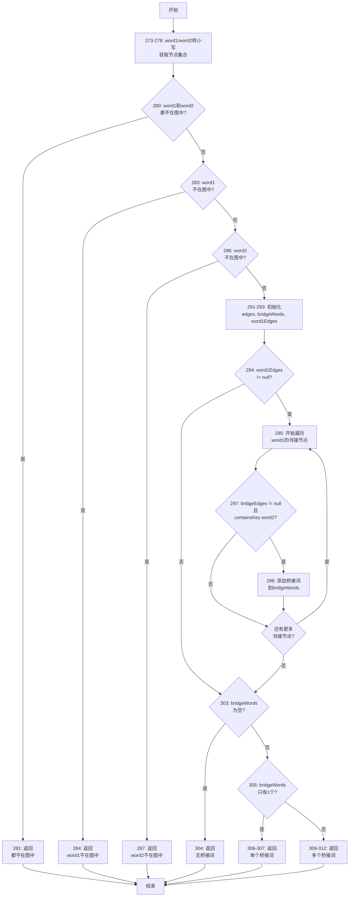
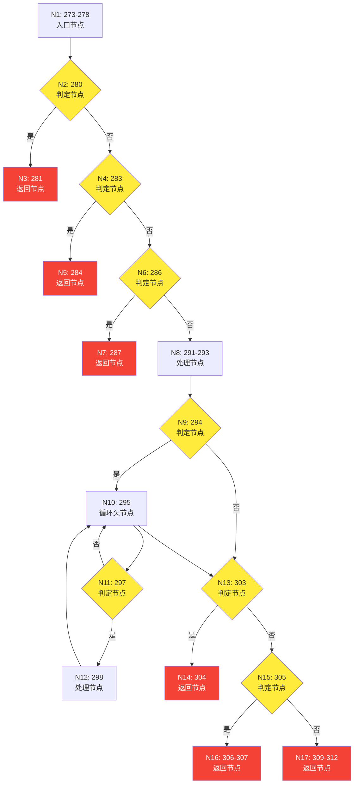

| 约束条件说明 | 有效等价类及其编号 | 无效等价类及其编号 |
|-------------|------------------|------------------|
| word1在图中的存在性 | (1) word1存在于图中 | (4) word1不存在于图中 |
| word2在图中的存在性 | (2) word2存在于图中 | (5) word2不存在于图中 |
| word1与word2的关系 | (3) word1与word2不相同且存在路径 | (6) word1与word2相同 |
| 路径连通性 | (7) word1到word2存在路径 | (8) word1到word2不存在路径 |

## 基于实际图结构的黑盒测试用例设计

根据提供的有向图（基于文本"The scientist carefully analyzed the data, wrote a detailed report, and shared the report with the team, but the team requested more data, so the scientist analyzed it again."），重新设计测试用例：

| 测试用例编号 | 输入 | 期望输出 | 所覆盖的等价类编号 |
|-------------|------|----------|------------------|
| TC01 | word1="the", word2="scientist" | "The shortest path from \"the\" to \"scientist\" is: the → scientist\nPath length: 1" | (1), (2), (3), (7) |
| TC02 | word1="hello", word2="scientist" | "No \"hello\" in the graph!" | (4), (2) |
| TC03 | word1="the", word2="the" | "The path from \"the\" to \"the\" is: the" | (1), (2), (6) |
| TC04 | word1="scientist", word2="team" | "The shortest path from \"scientist\" to \"team\" is: scientist → carefully → analyzed → the → data → wrote → a → detailed → report → and → shared → the → report → with → the → team\nPath length: 15" | (1), (2), (3), (7) |
| TC05 | word1="again", word2="scientist" | "No path from \"again\" to \"scientist\"!" | (1), (2), (3), (8) |

## 测试用例说明

**TC01**: 测试直接相邻节点的最短路径
- 从图中可以看到"the"直接连接到"scientist"，权重为1

**TC02**: 测试不存在的起始节点
- "hello"不在图中，应该返回相应的错误信息

**TC03**: 测试相同节点的路径查询
- 当起始节点和目标节点相同时的边界情况

**TC04**: 测试较长路径的最短路径计算
- 从"scientist"到"team"需要经过多个中间节点，测试Dijkstra算法的正确性

**TC05**: 测试两个节点都存在于图中但彼此不连通的情况
- "again"和"scientist"都存在于图中，但从图的结构可以看出，"again"是句子的最后一个词，它没有出边指向其他节点，因此无法到达"scientist"节点
- 这个测试用例验证了程序在处理图中存在孤立节点或单向连通情况时的正确性

注：实际路径长度可能因图的具体构建方式而有所不同，以程序实际运行结果为准。
流程图

控制流图

## 6.5 基本路径法白盒测试用例设计

| 测试用例编号 | 输入数据 | 期望的输出 | 所覆盖的基本路径编号 |
|-------------|----------|------------|---------------------|
| 1. | word1="hello", word2="scientist" | "No \"hello\" in the graph!" | 基本路径2: 273→280→283→284 |
| 2. | word1="again", word2="scientist" | "No bridge words from \"again\" to \"scientist\"!" | 基本路径4: 273→280→283→286→291→294→303→304 |
| 3. | word1="the", word2="data" | "The bridge words from \"the\" to \"data\" is: \"scientist\"" 或 "No bridge words from \"the\" to \"data\"!" | 基本路径5: 273→280→283→286→291→294→295→303→304 |
| 4. | word1="scientist", word2="analyzed" | "The bridge words from \"scientist\" to \"analyzed\" is: \"carefully\"" | 基本路径6: 273→280→283→286→291→294→295→297→298→295→303→305→306 |

### 测试用例说明：

**测试用例1**: 测试第一个单词不在图中的情况  
- word1不存在，word2存在，验证程序优先检测word1

**测试用例2**: 测试两个单词都存在但word1没有出边的情况
- "again"是句末单词，没有出边，验证程序返回无桥接词

**测试用例3**: 测试有出边但没有桥接词的情况
- word1有出边，但不能通过一个中间节点到达word2

**测试用例4**: 测试找到唯一桥接词的情况
- 验证程序能正确找到并返回单个桥接词

注：由于测试基于具体的图结构，某些期望输出可能需要根据实际图的构建结果进行调整。
